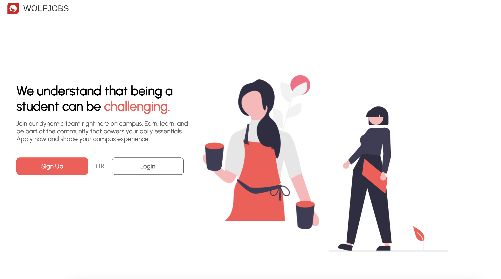

# Use Case Mini Tutorial

## Welcome to a mini tutorial of our WolfJobs web application. Here, you will get a detailed view about what to expect in the application, explore the various enhanced features and new functionalities, and look at real-life examples of using the application through screenshots.

### Landing Page

As you enter our application, you will be greeted by a beautiful home page that truly represents the wolfpack spirit of NCSU. Here you will find various tabs such as the Home, Login, and Signup. You will also see an Add Reviews and a View Reviews Button.

### Authentication

The first step as you start your journey of exploring the WolfJob web application is to sign up using a username and password. In our system there are two types of sign ups, one for managers and the other for the applicants.

#### Manager Sign Up

The picture below shows the page that opens up when you click the SIGNUP button that is located on the top right corner of the landing page. The drop down menu takes care of sign up as manager or as applicant.

#### Applicant Sign up

The following page shows the sign-up for applicant.

### Manger Dashboard

Upon sign in manage will be shown an empty dashboard where they can add new jobs or see jobs posted by other managers.

#### Manager - Add Job

We offer a button at the bottom right corner of the manage dashboard to be able to add new jobs. Adding job at the maanger's side involve 3 steps, a) Add basic details b) Add questions c) Finally add the job listing. All the steps are listed below in order.

Once the job is successfully, a success message will be shown and the job can now be visible in managers "My Application" tab.

#### Manager - Edit job

Once the manager has added a job, they can either update the basic details, close or delete the job.

#### Manager - Accept Job

Once an applicant applied for a job, manager may accept or reject a job using their dashboard.

#### Manager - Grade Job

Once the applicant get the acceptance email, they proceed on to next step to complete the application process at which stage the manager may grade the applicant.

#### Manager - View Resume

Once manager grades and approves an applicant they can view their resume.

### Applicant - Dashboard

Once signed in, applicants can see jobs posted by different managers, they can either save the jobs to apply later or apply. After applying the jobs will visible under their "My Applications" tab. The dashboard will also show them the details about the match with a specific job listing, days to apply and whether or not job closed. It will also show them their application status such "In-review", "accepted" or "rejected" or if they have applied for a specific job.

#### Aplicant - Apply Job

For applying the job, applicants will simply click the button apply.

#### Applicant - Accept Email

Once the application passes the preliminary review, the applicants will recive an accpetance email.

#### Applicant - Next Phase Process

Once the applicant receive the email that their application has been accepted, they may proceed over to fill the form for next review.

#### Applicant - Next Phase Acceptance

After successfully passing the second review, the applicants will again receive an acceptance email for second pahse.

#### Applicant - Notification

After successfully passing all the review stages, the applicant will recieve the notification whether they are accepted or rejected.

